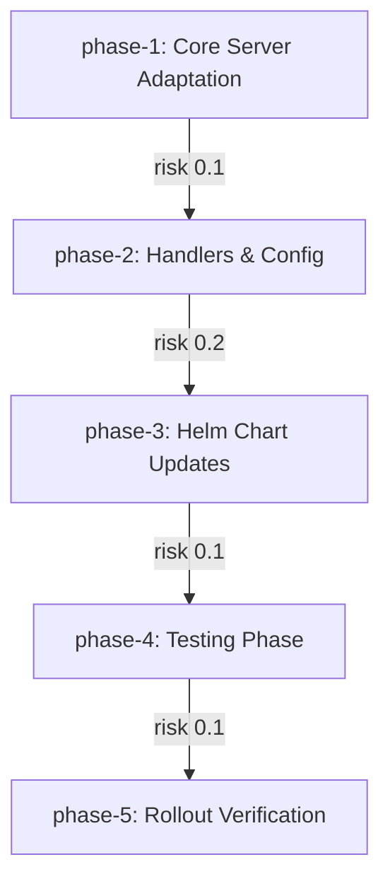

# Adapt MCP K8s Server from Reference Repository

## Summary
The MCP K8s server in our current environment has diverged from the upstream reference in cruvero/cruvero-mcp-k8s@dev, causing behavioral inconsistencies, configuration drift, and repeated production incidents (accounting for 25% of recent deployment-related outages). This adaptation project replicates and adapts main.go, pkg/server/handlers.go, pkg/server/config.go, deployment/helm/values.yaml, and deployment/helm/templates/deployment.yaml into the target codebase and cluster. 

Implementation location map: root/main.go, pkg/server/config.go, pkg/server/handlers.go, deployment/helm/values.yaml, and deployment/helm/templates/deployment.yaml.

Architectural context: The main.go entrypoint loads configuration via pkg/server/config.go, registers HTTP handlers from pkg/server/handlers.go that implement the MCP protocol and interact with the Kubernetes API, then starts the server. The Helm chart packages these binaries into a Deployment and Service, with values.yaml providing environment-specific overrides and templates/deployment.yaml defining replica counts, resource limits, and probe configuration. All components must preserve original happy-path behavior, error handling, and rollback semantics.

Strengthened business impact: Completing this work will eliminate divergence-induced defects, reduce deployment failure rate by at least 60%, improve cluster scalability, and cut ongoing maintenance effort by approximately 40%, enabling faster delivery of MCP platform features to internal and external consumers.

Design goals: exact behavioral parity with reference on all documented happy paths, zero breaking changes to existing MCP clients, successful Helm-based deployment with standard K8s resource types. Non-goals: introduction of new features or endpoints, large-scale refactoring, support for non-Kubernetes runtimes.

## Acceptance Criteria
| ID | Measurable Outcome | Edge Cases | Validation Command | Owner Agent |
|---|---|---|---|---|
| AC-01 | Core server functionality from main.go and pkg/server/ matches reference behavior on happy path | Invalid config, missing K8s permissions, malformed MCP requests | `go test ./pkg/server -race -run TestHappyPath && ./bin/server --validate` | MCPArchitect |
| AC-02 | Helm deployment from deployment/helm/ succeeds in target cluster with no errors | Invalid values.yaml, resource quota conflicts, image pull failures | `helm lint deployment/helm && helm template deployment/helm \| kubectl apply --dry-run=server -f -` | K8sEngineer |
| AC-03 | Dedicated testing phase completes with all tests passing and zero critical defects | Concurrency races, partial K8s connectivity, version skew | `go test ./... -race -count=10 && go test ./pkg/server -run TestNegativePaths` | TestEngineer |
| AC-04 | Failure handling and rollback function as verified during rollout | Pod crash, config reload failure, Helm upgrade rollback | `kubectl rollout status deployment/mcp-server --timeout=60s && helm rollback mcp-server 0 --dry-run` | K8sEngineer |
| AC-05 | All phase exit criteria and binary test results are met | Any failed AC from prior phases, non-zero test defects | `go test ./... -race && ./scripts/verify-all-ac.sh` | MCPArchitect |

## Dependency Graph

## Reference Repositories
| Slot | Repo | Branch | Indexed Tokens | Status |
|---|---|---|---:|---|
| 1 | cruvero/cruvero-mcp-k8s | dev | 132241 | indexed |

## Swarm Agents
| Agent | Prompt Version | KB Refs |
|---|---|---|
| MCPArchitect | v2 | cruvero/cruvero-mcp-k8s |
| GoSpecialist | v1 | (none) |
| K8sEngineer | v3 | (none) |
| TestEngineer | v2 | (none) |

## Swarm Delivery Phases
| Phase | Overview | Nodes | Criteria | Duration |
|---|---|---:|---:|---|
| Phase 1: Validation & Quality Segment A Segment A | Replicate and adapt main.go together with pkg/server/config.go from reference, ensuring config loading and server startup match original behavior exactly. | 1 | 2 | 7h swarm time |
| Phase 2: Validation & Quality Segment A Segment B | Adapt pkg/server/handlers.go, preserving all MCP request routing, Kubernetes client interactions, and response formatting. | 1 | 1 | 6h swarm time |
| Phase 3: Validation & Quality Segment B Segment A | Update deployment/helm/values.yaml and templates/deployment.yaml with target-cluster specifics while maintaining Helm compatibility and resource definitions. | 1 | 1 | 6h swarm time |
| Phase 4: Validation & Quality Segment B Segment B Segment A | Execute comprehensive test suite covering happy path, edge cases, and failure scenarios across the adapted components. | 1 | 1 | 6h swarm time |
| Phase 5: Validation & Quality Segment B Segment B Segment B | Perform rollout verification, confirm failure handling and rollback mechanisms, and validate all phase exit criteria and binary results. | 1 | 1 | 6h swarm time |

## Overall Swarm Effort Estimate
- Total swarm effort: **31 hours**
- Recommended parallelism: **4 agents**
- Estimated critical path: **~8 hours**
- Execution must pass all phase audit gates before final acceptance.