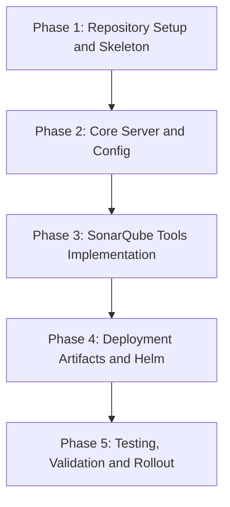

# Implement cruvero-mcp-sonarqube MCP Server

## Summary
Develop a Model Context Protocol (MCP) server for SonarQube Community Edition by replicating the exact structure, dual-mode runtime (stdio + HTTP gateway), logging, OTEL, gateway registration, capabilities exporter, and non-domain patterns from the reference Kubernetes MCP server (github.com/cruvero/cruvero-mcp-k8s), while replacing Kubernetes logic with SonarQube tools for querying all issue types by project and branch, and updating issues to resolve, wontfix, or falsepositive using bulk strategies for larger sets (>10 items).

Implementation location map: root/main.go, pkg/server/config.go, pkg/server/handlers.go, internal/sonarqube/client.go, tools/sonarqube_handlers.go, deployment/helm/values.yaml, deployment/helm/templates/deployment.yaml.

Architectural context: main.go loads configuration via pkg/server/config.go (including global Sonar token), registers MCP handlers and SonarQube tools that interact with SonarQube API (preserving OTEL and logging), then starts the server in either stdio or gateway mode. The Helm chart packages the binary with token injection from Vault.

Business impact: Enables SonarQube issue management through MCP with risk tiers (read/write/destructive), future-proofed for multi-instance and RBAC, while maintaining exact non-domain behavior from reference.

Design decisions: Use official SonarQube API fields (status: 'RESOLVED', 'WONTFIX', 'FALSEPOSITIVE'); implement bulk update endpoint for larger sets; single global token for Community Edition with extension points for multi-tenant.

## Dependency Graph

## Acceptance Criteria Traceability
See docs/AUDIT/acceptance-criteria.md for the complete table with measurable outcomes, validation commands, and status. All ACs are linked to phases and risks above.